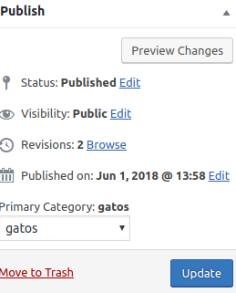

# Select Primary Category

Choose the main category for your posts.

**Contributors:** [oscarssanchez](https://github.com/oscarssanchez)  
**Tags:** [category](https://wordpress.org/plugins/tags/category)  
**Requires at least:** 4.9  
**Tested up to:** 4.9  
**Stable tag:** 1.0  
**License:** [GPLv2 or later](http://www.gnu.org/licenses/gpl-2.0.html)  
**Requires PHP:** 5.3.2  

## Description ##

Choose the main category for your posts.

## Screenshots ##

### Add/edit screen post.

## Installation ##

* Upload the folder to your /wp-content/plugins/ directory
* Activate the plugin through the 'Plugins' menu in WordPress

## Changelog ##

* 1.0 Release